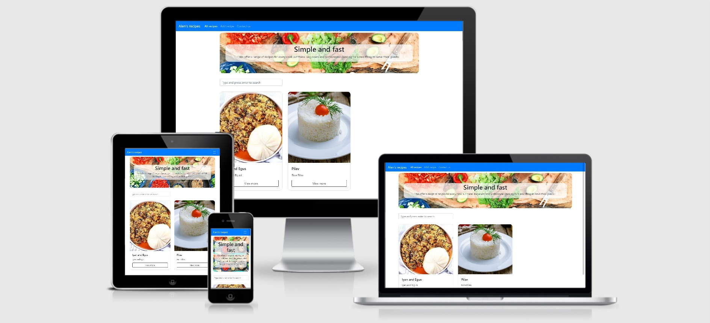

# RevisedCookApplication

Deployed app: [https://revised-cookapplication.herokuapp.com/](https://revised-cookapplication.herokuapp.com/)
This is the revised version of my first attempt to create a Cook Book.

The main goal of this project is to create a shared database of recipes. The project represents all 4 CRUD operations (Create, Read, Update, Delete).

- The brief for this project is as follows:
Create a web application that allows users to add and easily access cooking recipes.
Put some effort into designing a database schema based on recipes and their required fields.
Create the backend code and frontend form to allow users to add new recipes to the site.
Create the backend code to retrieve a list of recipes, filtered based on a search parameter. Create a frontend page to display these.
Create a detailed view for each recipe, that would just show all fields of that recipe, and the full preparation instructions.
Allow for editing and deleting of the recipe records.

## UX

- This app was made for adding recipes, editing, deleting and viewing.

- Users adding recipes:
We want to easily add recipes to the site's database. We want to access these recipes in future easily and view details of the recipe.

- Users searching for recipes:
We want to be able to easily access recipes based on a search parameter.

- Users editing recipes:
The same form for adding the recipes is used here, which makes it really easy and fast to edit a recipe.

## Wireframes
- [Mobile devices](static/img/Mobile.png)
- [Desktop devices](static/img/Desktop.png)

##  Existing Features

- There is a 'Scroll to top' function on all pages.
- 'Contact me' form uses emailJS to send an email to the admin.
- Users can view all recipes on the home page and easily search for any recipe they like. Clicking on the recipe goes to the recipe details page where the user can see all the info about preparing the meal.
- Users can easily add a new recipe. Custom ingredient list was made by custom Javascript. On every 'Add ingredient' click, the code generates an element programmatically. Ingredients with empty fields are ignored in the backend.
- On the product details page, there are two buttons, for editing and for deleting a recipe. Editing the recipe opens up the same form as creating the recipe, but with pre-filled data. The user can then change what he wants and save the changes. Deleting the item opens a modal that asks the user if he's sure he wants to delete the recipe as this operation cannot be undone. Confirming the deletion removes the recipe forever.

##  Features Left to Implement

- User authentication
- More fields for the recipe (allergens, required tools,...)

## Technologies Used

- HTML - The project uses HTML to structure the site.
- CSS - The project uses CSS to style the site.
- JQuery - Used for simplifying the DOM manipulations in Javascript.
- Bootstrap - Used as a UI library.
- FontAwesome - The project uses FontAwesome icons.

- Flask - microframework
- Click - command line interface in Flask
- dnspython - DNS toolkit for Python
- Jinja - template language
- Flask-PyMongo - Communication with MongoDB
- itsdangerous - cryptographically signing data
- Werkzeug - CGI Library

- MongoDB - NoSQL database for storing JSON-like objects

## Testing

Manual testing was conducted to verify the proper functionality of the website.

- There are no dead links on the website.
- There are no errors and warnings in the Developer console
- The page is fully responsive and has been tested using the Developer console.

### Mobile
- Galaxy S5
- Pixel 2
- Pixel 2 XL
- iPhone 4
- iPhone 5 SE
- iPhone 6, 7 and 8
- iPhone 6, 7 and 8 Plus (real device)
- iPhone X

### Tablet
- iPad
- iPad Pro

### Laptop
- Macbook

### Browsers
- Chome
- Safari
- Firefox
- Opera

## Deployment

The deployment is done via Github. I connected my account to my Heroku account and used that to deploy the latest master branch of the github repo. Required environment variables are 
['MONGO_URI', 'DEBUG': 'FALSE', 'IP': '0.0.0.0', 'PORT': '8080']

## Credits

- Home page jumbotron image was found on Pexels.
- I used all the resources that were given by the Code Institute.